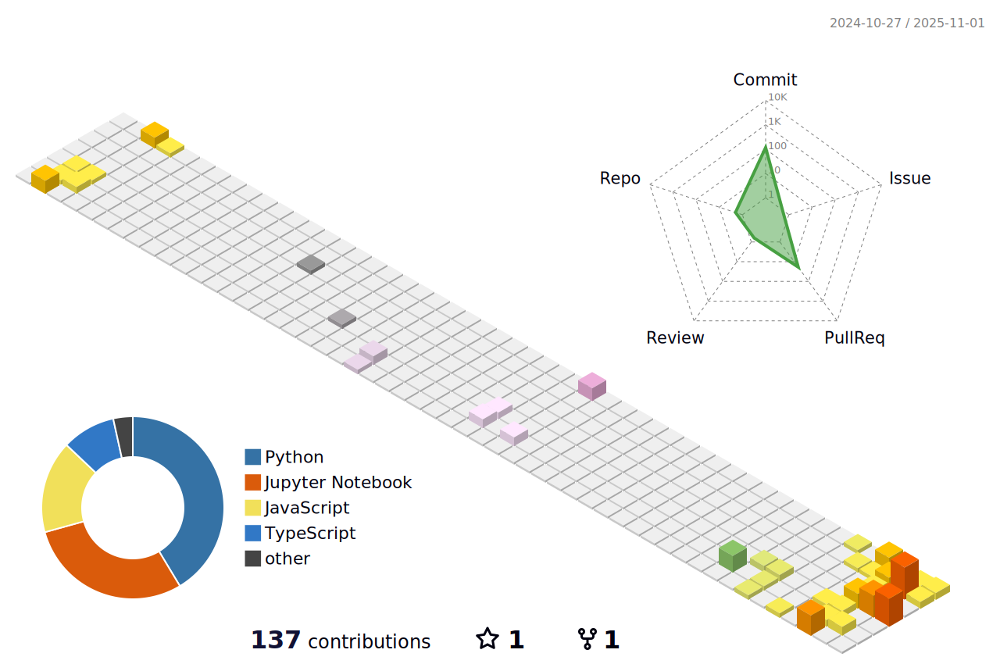

* 🌍  I'm based in Riverside, CA
* 🖥️  See my portfolio at [xwu136.com](http://xwu136.com)
* ✉️  You can contact me at [xwu136@gmail.com](mailto:xwu136@gmail.com)
* 🧠  I'm pursuing a bachelor's in computer science at the University of California, Riverside(UCR)
* ⚡  Actively seeking Internship opportunities for Data Analyst/Scientist positions.

## Connect

